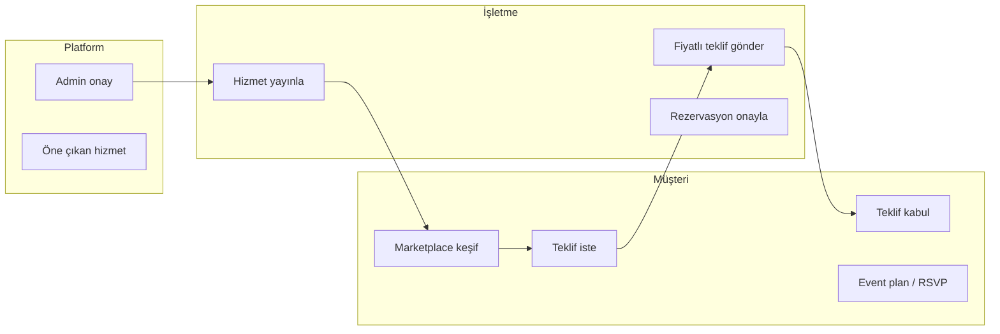
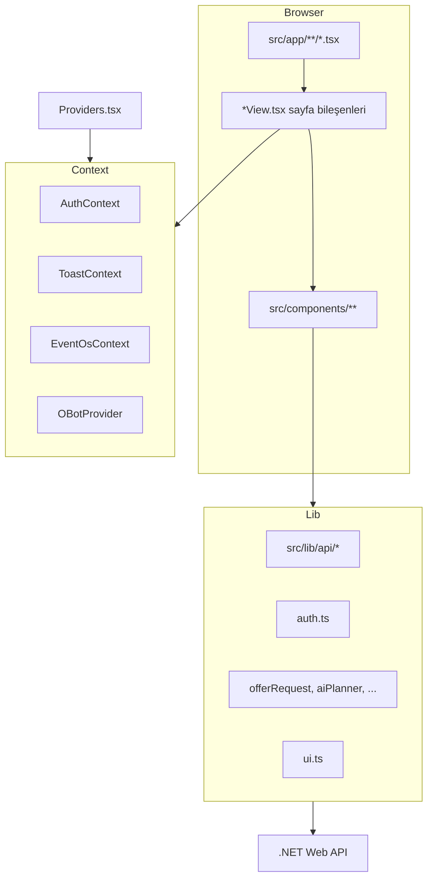
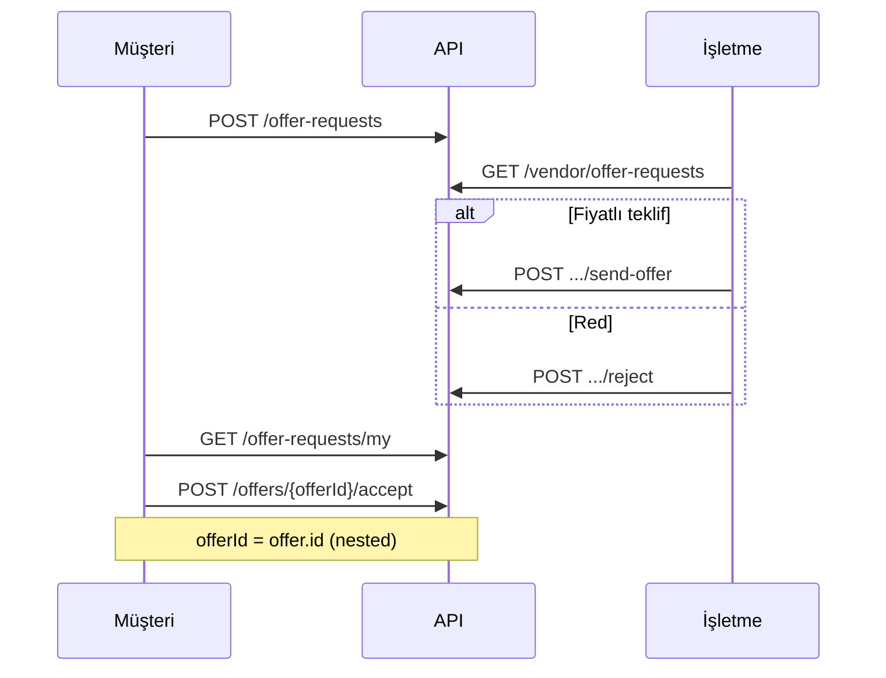

# ORIVONA Landing — Tam Proje Dokümantasyonu

Bu belge **orivona-landing** deposunun eksiksiz teknik ve işlevsel referansıdır. Proje, ORIVONA etkinlik organizasyon platformunun **Next.js 16 frontend istemcisidir**. İş kuralları ve veritabanı harici bir **ASP.NET Core Web API** üzerindedir; bu repo yalnızca arayüz, API entegrasyonu ve demo/SaaS özelliklerini içerir.

**Son tarama:** `src/` altındaki tüm modüller, rotalar ve `src/lib/api/*` endpoint path’leri.

---

## İçindekiler

1. [Proje özeti](#1-proje-özeti)
2. [Teknoloji ve bağımlılıklar](#2-teknoloji-ve-bağımlılıklar)
3. [Kurulum, ortam ve build](#3-kurulum-ortam-ve-build)
4. [Mimari](#4-mimari)
5. [Dizin yapısı (tam)](#5-dizin-yapısı-tam)
6. [Uygulama kabuğu ve global davranış](#6-uygulama-kabuğu-ve-global-davranış)
7. [Kimlik doğrulama ve yetkilendirme](#7-kimlik-doğrulama-ve-yetkilendirme)
8. [API katmanı](#8-api-katmanı)
9. [Tüm HTTP endpoint referansı](#9-tüm-http-endpoint-referansı)
10. [Sayfalar ve rotalar](#10-sayfalar-ve-rotalar)
11. [Ana sayfa (landing)](#11-ana-sayfa-landing)
12. [Marketplace ve hizmet detay](#12-marketplace-ve-hizmet-detay)
13. [Teklif müzakeresi (iki taraflı)](#13-teklif-müzakeresi-iki-taraflı)
14. [Rezervasyonlar](#14-rezervasyonlar)
15. [AI Planlayıcı ve AI Intelligence](#15-ai-planlayıcı-ve-ai-intelligence)
16. [Müşteri paneli](#16-müşteri-paneli)
17. [İşletme (Vendor) paneli](#17-işletme-vendor-paneli)
18. [Admin paneli](#18-admin-paneli)
19. [Event OS — etkinlik planı işletim sistemi](#19-event-os--etkinlik-planı-işletim-sistemi)
20. [Davet ve herkese açık etkinlik sayfaları](#20-davet-ve-herkese-açık-etkinlik-sayfaları)
21. [Mesajlaşma ve bildirimler](#21-mesajlaşma-ve-bildirimler)
22. [Ticaret modülü (Commerce)](#22-ticaret-modülü-commerce)
23. [Vendor Intelligence (CRM & analitik)](#23-vendor-intelligence-crm--analitik)
24. [Premium / SaaS özellikleri](#24-premium--saas-özellikleri)
25. [Yardım, SSS ve O-Bot](#25-yardım-sss-ve-o-bot)
26. [SEO, analitik ve site sabitleri](#26-seo-analitik-ve-site-sabitleri)
27. [Yardımcı kütüphaneler (`src/lib`)](#27-yardımcı-kütüphaneler-srclib)
28. [React hook’ları](#28-react-hookları)
29. [Bileşen envanteri (`src/components`)](#29-bileşen-envanteri-srccomponents)
30. [TypeScript tipleri](#30-typescript-tipleri)
31. [Hata yönetimi ve UX kuralları](#31-hata-yönetimi-ve-ux-kuralları)
32. [Tasarım sistemi](#32-tasarım-sistemi)
33. [Yeni özellik ekleme rehberi](#33-yeni-özellik-ekleme-rehberi)
34. [Bilinen sınırlamalar](#34-bilinen-sınırlamalar)

---

## 1. Proje özeti

| Alan | Değer |
|------|--------|
| Paket adı | `orivona-landing` |
| Amaç | Etkinlik organizasyonu: keşif, teklif, rezervasyon, planlama, CRM, admin |
| Backend | `NEXT_PUBLIC_API_BASE_URL` → REST API (ör. Render: `https://orivonawebapi.onrender.com/api`) |
| Auth | JWT — `localStorage` anahtarı `orivona_auth_token` |
| Roller | **Customer**, **Vendor**, **Admin** |
| Dağıtım | Vercel / `npm run build` + `npm run start` |

### İş modeli (yüksek seviye)



---

## 2. Teknoloji ve bağımlılıklar

| Paket | Sürüm | Kullanım |
|-------|-------|----------|
| next | 16.2.6 | App Router, SSR/SSG, routing |
| react / react-dom | 19.2.4 | UI |
| typescript | ^5 | Tip güvenliği |
| tailwindcss | ^4 | Stil |
| lucide-react | ^1.16 | İkonlar |
| qrcode | ^1.5.4 | Davet / bilet QR |

Harici global state kütüphanesi yok (`redux` vb.). Durum: React Context + yerel `useState`.

**Next.js notu:** `AGENTS.md` — bu sürüm eğitim verisinden farklı olabilir; `node_modules/next/dist/docs/` ve deprecation uyarılarına bakın.

---

## 3. Kurulum, ortam ve build

```bash
npm install
cp .env.example .env.local
# .env.local:
# NEXT_PUBLIC_API_BASE_URL=http://localhost:8080/api

npm run dev      # http://localhost:3000
npm run build
npm run start
npm run lint
```

| Değişken | Zorunlu | Açıklama |
|----------|---------|----------|
| `NEXT_PUBLIC_API_BASE_URL` | Evet | API kökü; `/api` suffix ile |

`public/` altına büyük installer dosyaları eklemeyin (git’e girmemeli).

---

## 4. Mimari



### Tipik istek akışı

1. Kullanıcı route açar → `src/app/.../page.tsx`
2. `*View.tsx` render (çoğu `"use client"`)
3. `ProtectedRoute` rol kontrolü (panel sayfaları)
4. `src/lib/api` fonksiyonu çağrılır
5. `client.ts`: `fetch` + `Authorization: Bearer`
6. Yanıt `{ success, message, data }` parse → `normalize*`
7. UI güncellenir; hata → toast / inline alert

---

## 5. Dizin yapısı (tam)

```
orivona-landing/
├── docs/
│   └── DOKUMANTASYON.md          # Bu dosya
├── public/
│   ├── marketplace/categories/   # Kategori yedek görselleri (*.jpg)
│   ├── og-image.png
│   └── orivona-icon-*.png
├── src/
│   ├── app/                      # Next.js App Router
│   │   ├── layout.tsx            # Root layout, Providers, font, metadata
│   │   ├── globals.css
│   │   ├── page.tsx              # Ana landing
│   │   ├── login/, register/, account/
│   │   ├── marketplace/
│   │   ├── services/[id]/
│   │   ├── ai-planner/, event-wizard/
│   │   ├── customer/dashboard/, vendor/dashboard/, admin/dashboard/
│   │   ├── faq/
│   │   ├── event/[slug]/         # Public event page
│   │   ├── invite/[token]/, invite/event/[token]/
│   │   ├── robots.txt, sitemap.xml
│   ├── components/               # ~159 TSX dosyası — bölüm 29
│   ├── contexts/
│   │   ├── AuthContext.tsx
│   │   └── ToastContext.tsx
│   ├── hooks/                    # 6 hook — bölüm 28
│   └── lib/                      # 61 TS dosyası — bölüm 27
├── .env.example
├── next.config.ts
├── package.json
├── tailwind / postcss config
├── AGENTS.md
└── README.md
```

---

## 6. Uygulama kabuğu ve global davranış

### `src/app/layout.tsx`

- Geist font, `globals.css`
- `Providers` sarmalayıcı
- `StructuredData` (JSON-LD)
- Google Analytics (`GA_MEASUREMENT_ID`, route listener)

### `src/components/Providers.tsx`

Sıra: `ToastProvider` → `AuthProvider` → `OrivonaGlobalBackground` → children → `OBotProvider`.

### Layout türleri

| Kabuk | Kullanım |
|-------|----------|
| `HomeNavbar` + landing sections | `/` |
| `OrivonaSiteHeader` (`variant="app"`) | Marketplace, AI, FAQ |
| `DemoShell` | Eski basit demo sayfalar (login vb. hâlâ kullanılabilir) |
| `DashboardLayout` + `DashboardSidebar` | Customer / Vendor / Admin panelleri |

### Hash navigasyon

- `useDashboardHashScroll` — panel içi `#dashboard-offers` kaydırma
- `scrollToDashboardSection.ts` — offset, pending hash, layout ready event
- `useHomeHashScroll` — landing section anchor’ları

---

## 7. Kimlik doğrulama ve yetkilendirme

### Dosyalar

| Dosya | Görev |
|-------|--------|
| `src/lib/auth.ts` | Token, login/register, `getCurrentUser` |
| `src/contexts/AuthContext.tsx` | Global user/role, refresh, logout |
| `src/components/app/ProtectedRoute.tsx` | Token + rol gate |
| `src/lib/authEmail.ts` | E-posta doğrulama, forgot-password |
| `src/lib/authRedirect.ts` | Login sonrası yönlendirme |
| `src/lib/passwordPolicy.ts` | Şifre kuralları (kayıt) |

### Auth API

| Method | Path | Açıklama |
|--------|------|----------|
| POST | `/auth/login` | JWT döner → `localStorage` |
| POST | `/auth/register/customer` | Müşteri kayıt |
| POST | `/auth/register/vendor` | İşletme kayıt |
| GET | `/auth/me` | Oturum doğrulama (sayfa yükü) |
| POST | `/auth/forgot-password` | Şifre sıfırlama isteği |
| POST | `/auth/verify-email` | E-posta doğrulama |
| POST | `/auth/send-email-verification` | Doğrulama maili gönder |

### Token davranışı

- Header: `Authorization: Bearer <token>`
- **401:** Genel API client token’ı otomatik silmez (oturum kaybı önlenir); yalnızca `logout()` veya geçersiz oturum akışında temizlenir
- `ProtectedRoute`: token yok → `/login`; rol uymuyor → `/login?unauthorized=1`

### Rol yönlendirme

| Rol | Dashboard | Hesabım |
|-----|-----------|---------|
| Customer | `/customer/dashboard` | Aynı |
| Vendor | `/vendor/dashboard` | Aynı |
| Admin | `/admin/dashboard` | Aynı |

`normalizeRole`: `customer`/`user` → Customer, `vendor`/`business` → Vendor, `admin` → Admin.

### Kayıt UI (`RegisterView.tsx`)

- Müşteri / işletme seçimi (`?type=vendor`)
- KVKK onayı (`KvkkConsentField`)
- Şifre gücü (`PasswordStrengthField`)
- İşletme: şirket tipi, vergi/kimlik alanları (`vendorIdentity.ts`)

---

## 8. API katmanı

### Merkezi export: `src/lib/api.ts`

Tüm domain fonksiyonları buradan re-export edilir. Uygulama kodu tercihen:

```ts
import { fetchMarketplace, acceptCustomerOffer } from "@/src/lib/api";
```

### Modül haritası

| Dosya | Sorumluluk |
|-------|------------|
| `api/client.ts` | `fetch`, `ApiError`, `apiGetRaw`, `apiPostRaw`, `withOptionalNotFound`, hata formatlama |
| `api/types.ts` | Tüm TS tipleri (~900+ satır) |
| `api/index.ts` | Marketplace, vendor services, event-requests, account, categories |
| `api/domains.ts` | Özet, favori, teklif, rezervasyon, admin, bildirim, mesaj, müsaitlik, yorum, AI event-plan |
| `api/eventPlans.ts` | Plan, görev, davetli, RSVP, oturma, hatırlatma, QR |
| `api/invites.ts` | Plan bazlı misafir daveti (token) |
| `api/publicEventInvite.ts` | Ortak etkinlik davet linki |
| `api/premiumSaas.ts` | Arama, aktivite, pano, pipeline, AI kayıt, wizard, public page, check-in |
| `api/commerce.ts` | Medya upload, promosyon, kupon, kampanya |
| `api/vendorIntelligence.ts` | Lead, analitik, review summary |
| `api/aiIntelligence.ts` | Moodboard, budget optimizer, style match, vb. |
| `api/helpAssistant.ts` | O-Bot yardım API |
| `api/vendorDashboardFetch.ts` | Vendor GET retry + timeout |
| `api/errorMessages.ts` | Türkçe API hata insanileştirme |

### Yanıt zarfı

```json
{
  "success": true,
  "message": "İsteal edildi",
  "data": { }
}
```

- `assertSuccess` / `assertEnvelopeSuccess` — `success === false` → throw
- Listeler: `toList()` — `items`, `results`, `data`, `eventRequests` vb. anahtarları dener
- Alan adları: `recordStr`, `recordNum`, `recordId` — camelCase + PascalCase

### Vendor GET retry

`vendorGetWithRetry()` — işletme panelinde ağır endpoint’ler için yeniden deneme ve yükleme mesajı (`VENDOR_LOADING_MESSAGE`).

### Opsiyonel 404

```ts
withOptionalNotFound(fn, fallback, "endpoint not available yet")
```

Örnek: `GET /customer/dashboard/summary` → production’da 404 ise `{}` döner, UI kırılmaz.

---

## 9. Tüm HTTP endpoint referansı

Base: `{NEXT_PUBLIC_API_BASE_URL}` + path. Auth gerektirenler `Bearer` token kullanır; AI event-plan ve public sayfalar `apiPostPublicRaw` / `apiGetPublicRaw` kullanabilir.

### Kimlik ve profil

| Method | Path |
|--------|------|
| POST | `/auth/login` |
| POST | `/auth/register/customer` |
| POST | `/auth/register/vendor` |
| GET | `/auth/me` |
| POST | `/auth/forgot-password` |
| POST | `/auth/verify-email` |
| POST | `/auth/send-email-verification` |
| GET | `/account/profile` |
| PUT | `/account/profile` |

### Marketplace ve hizmetler

| Method | Path |
|--------|------|
| GET | `/services` (query: city, district, categoryId, minPrice, maxPrice, minRating, guestCount, keyword, page, sortBy) |
| GET | `/services/{id}` |
| GET | `/categories` |
| POST | `/services/{serviceId}/reviews` |
| GET | `/services/{serviceId}/reviews` |
| GET | `/services/{serviceId}/availability` |
| GET | `/services/{serviceId}/availability/heatmap` |
| GET | `/services/{serviceId}/badges` |
| GET | `/services/{serviceId}/media` |
| POST | `/services/{serviceId}/track-view` |
| GET | `/services/{serviceId}/review-summary` |

### Favoriler

| Method | Path |
|--------|------|
| GET | `/favorites` |
| POST | `/favorites/{vendorServiceId}` |
| DELETE | `/favorites/{vendorServiceId}` |

### Teklif talepleri ve teklifler

| Method | Path |
|--------|------|
| POST | `/offer-requests` |
| GET | `/offer-requests/my` |
| GET | `/vendor/offer-requests` |
| POST | `/vendor/offer-requests/{requestId}/send-offer` |
| POST | `/vendor/offer-requests/{requestId}/reject` |
| POST | `/offers/{offerId}/accept` |
| POST | `/offers/{offerId}/reject` |

**Kritik:** `accept`/`reject` için `offerId` = nested `offer.id` — **asla** `offerRequest.id` değil (`extractVendorOfferId` in `domains.ts`).

### Rezervasyonlar

| Method | Path |
|--------|------|
| POST | `/reservations` |
| GET | `/reservations/my` |
| POST | `/reservations/{id}/cancel` |
| GET | `/vendor/reservations` |
| POST | `/vendor/reservations/{id}/confirm` |
| POST | `/vendor/reservations/{id}/complete` |

### Dashboard özetleri

| Method | Path |
|--------|------|
| GET | `/customer/dashboard/summary` (404 toleranslı) |
| GET | `/vendor/dashboard/summary` |
| GET | `/admin/dashboard/summary` |
| GET | `/admin/summary` (legacy optional) |

### Müşteri etkinlik talepleri (platform talebi)

| Method | Path |
|--------|------|
| GET | `/event-requests/my` |
| GET | `/event-requests/{id}` |
| POST | `/event-requests` |
| PUT | `/event-requests/{id}` |
| DELETE | `/event-requests/{id}` |

### Vendor hizmet ve profil

| Method | Path |
|--------|------|
| GET | `/vendor/profile` |
| GET | `/vendor/services` |
| POST | `/vendor/services` |
| PUT | `/vendor/services/{id}` |
| DELETE | `/vendor/services/{id}` |
| GET | `/vendor/services/{serviceId}/images` |
| POST | `/vendor/services/{serviceId}/images` |
| PUT | `/vendor/services/{serviceId}/images/{imageId}` |
| DELETE | `/vendor/services/{serviceId}/images/{imageId}` |
| POST | `/vendor/services/{serviceId}/media/upload` |
| POST | `/vendor/services/{serviceId}/media` |
| DELETE | `/vendor/services/{serviceId}/media/{mediaId}` |
| POST | `/vendor/services/{serviceId}/media/{mediaId}/cover` |

### Müsaitlik

| Method | Path |
|--------|------|
| GET | `/vendor/availability` |
| POST | `/vendor/availability` |
| DELETE | `/vendor/availability/{id}` |
| GET | `/vendor/availability/heatmap` |

### Admin

| Method | Path |
|--------|------|
| GET | `/admin/vendors` |
| GET | `/admin/vendors/pending` |
| POST | `/admin/vendors/{id}/approve` |
| POST | `/admin/vendors/{id}/reject` |
| POST | `/admin/vendors/{id}/activate` |
| POST | `/admin/vendors/{id}/deactivate` |
| GET | `/admin/categories` |
| POST | `/admin/categories` |
| PUT | `/admin/categories/{id}` |
| DELETE | `/admin/categories/{id}` |
| GET | `/admin/users` |
| POST | `/admin/users/{id}/activate` |
| POST | `/admin/users/{id}/deactivate` |
| GET | `/admin/services` |
| POST | `/admin/services/{id}/feature` |
| POST | `/admin/services/{id}/unfeature` |
| POST | `/admin/vendors/{vendorId}/badges` |
| DELETE | `/admin/vendors/{vendorId}/badges/{badgeType}` |
| POST | `/admin/services/{serviceId}/badges` |
| DELETE | `/admin/services/{serviceId}/badges/{badgeType}` |

### Bildirim ve mesaj

| Method | Path |
|--------|------|
| GET | `/notifications` |
| POST | `/notifications/{id}/read` |
| POST | `/notifications/read-all` |
| POST | `/notifications/generate-smart` |
| GET | `/conversations` |
| POST | `/conversations` |
| GET | `/conversations/{conversationId}/messages` |
| POST | `/conversations/{conversationId}/messages` |

### AI (public ve authenticated)

| Method | Path |
|--------|------|
| POST | `/ai/event-plan` (public) |
| POST | `/ai/recommendations` (public) |
| POST | `/ai/moodboard` |
| POST | `/ai/budget-optimizer` |
| POST | `/ai/missing-services` |
| POST | `/ai/style-match` |
| POST | `/ai/similar-events` |
| POST | `/ai/pricing-insights` |
| POST | `/ai/vendor-match` |
| POST | `/ai/plans/save` |
| GET | `/ai/plans/my` |
| GET | `/ai/plans/{id}` |
| DELETE | `/ai/plans/{id}` |
| POST | `/ai/event-wizard/complete` |

### Event plans (Event OS)

| Method | Path |
|--------|------|
| GET | `/event-plans/my` |
| GET | `/event-plans/{id}` |
| POST | `/event-plans` |
| PUT | `/event-plans/{id}` |
| DELETE | `/event-plans/{id}` |
| GET/POST/PUT/DELETE | `/event-plans/{planId}/tasks` … |
| GET/POST/PUT/DELETE | `/event-plans/{planId}/guests` … |
| POST | `/event-plans/{planId}/guests/{guestId}/send-invite` |
| POST | `/event-plans/{planId}/guests/send-invites-bulk` |
| PUT | `/event-plans/{planId}/guests/{guestId}/rsvp` |
| GET | `/event-plans/{planId}/rsvp-summary` |
| GET | `/event-plans/{planId}/qr-invite` |
| GET/POST/PUT/DELETE | `/event-plans/{planId}/seating/...` |
| GET | `/event-plans/{planId}/reminders` |
| POST | `/event-plans/{planId}/reminders/generate` |
| POST | `/event-plans/{planId}/tasks/generate` |
| GET | `/event-plans/{planId}/board` |
| PUT | `/event-plans/{planId}/board/items/{itemId}/status` |
| GET/POST | `/event-plans/{planId}/public-invite` |
| POST | `/event-plans/{planId}/public-invite/disable` |
| GET/PUT | `/event-plans/{planId}/public-page` |
| POST | `/event-plans/{planId}/public-page/disable` |

### Public davet

| Method | Path |
|--------|------|
| GET | `/invites/event/{token}` |
| POST | `/invites/event/{token}/verify-guest` |
| POST | `/invites/event/{token}/rsvp` |
| GET | `/invites/event/{token}/ticket` |
| GET | `/events/public/{slug}` |

### Vendor CRM & analitik

| Method | Path |
|--------|------|
| GET | `/vendor/leads` |
| GET | `/vendor/leads/{id}` |
| POST | `/vendor/leads/{id}/status` |
| POST | `/vendor/leads/{id}/note` |
| PUT | `/vendor/leads/{stage}/stage` |
| GET | `/vendor/pipeline` |
| GET | `/vendor/analytics/summary` |
| GET | `/vendor/analytics/services` |
| GET | `/vendor/analytics/leads` |
| GET | `/vendor/analytics/monthly` |
| GET | `/vendor/review-summary` |
| GET | `/vendor/activity-feed` |

### Commerce

| Method | Path |
|--------|------|
| GET | `/vendor/promotions` |
| GET | `/admin/promotions` |
| POST | `/admin/services/{serviceId}/promote` |
| POST | `/admin/promotions/{id}/disable` |
| POST | `/coupons/validate` |
| CRUD | `/vendor/coupons`, `/admin/coupons` |
| GET | `/campaigns/active` |
| CRUD | `/admin/campaigns` |

### Premium / diğer

| Method | Path |
|--------|------|
| GET | `/search/global?q=` |
| GET | `/activity-feed/my` |
| GET | `/admin/activity-feed` |
| POST | `/vendor/check-in/verify` |
| POST | `/vendor/check-in/confirm` |
| GET | `/mobile/home` (vendor mobile özet) |

---

## 10. Sayfalar ve rotalar

| Route | View / Page | Erişim |
|-------|-------------|--------|
| `/` | `app/page.tsx` + home sections | Public |
| `/login` | `LoginView` | Public |
| `/register` | `RegisterView` | Public |
| `/faq` | `FaqPageView` | Public |
| `/marketplace` | `MarketplaceView` | Public |
| `/services/[id]` | `ServiceDetailView` | Public |
| `/ai-planner` | `AiPlannerView` | Public (+ AI public POST) |
| `/event-wizard` | `EventWizardView` | Customer |
| `/account` | `AccountProfileView` | Auth |
| `/customer/dashboard` | `CustomerDashboardView` | Customer |
| `/vendor/dashboard` | `VendorDashboardView` | Vendor |
| `/admin/dashboard` | `AdminDashboardView` | Admin |
| `/event/[slug]` | `PublicEventPageView` | Public |
| `/invite/[token]` | `InvitePublicView` | Token |
| `/invite/event/[token]` | Event invite flow | Token |

---

## 11. Ana sayfa (landing)

`src/app/page.tsx` bileşenleri:

| Bileşen | İşlev |
|---------|--------|
| `HomeHashScroll` | URL hash ile section scroll |
| `HomeNavbar` | Üst menü, auth linkleri |
| `HomeHero` | Ana kahraman, CTA |
| `HomeMarketplacePreview` | Öne çıkan hizmetler (API) |
| `HomeHowItWorks` | 5 adımlı süreç (`helpContent.ts`) |
| `HomeTrustSection` | Güven unsurları |
| `HomeAiPlannerShowcase` | AI tanıtım |
| `HomeFaqCta` | SSS’e yönlendirme |
| `HomeVendorSection` | İşletme kayıt CTA |
| `HomeContactSection` | İletişim formu (`contactValidation.ts`) |
| `HomeFooter` | Alt bilgi |

Eski landing parçaları: `components/landing/*` (AiPlanningDemo, AnimatedMetrics, MouseGlowLayer, vb.) — bazıları hâlâ import edilebilir.

---

## 12. Marketplace ve hizmet detay

### Marketplace (`MarketplaceView.tsx`)

- Filtreler: şehir, ilçe, kategori (GUID `categoryId`), fiyat, puan, misafir, anahtar kelime, sıralama
- `buildMarketplaceQueryParams` — boş parametreleri göndermez
- `fetchMarketplace` → `GET /services?...`
- Kart: `MarketplaceServiceCard` — görsel (`serviceImage.ts`, `ServiceCoverImage`), favori, detay linki, teklif
- Giriş yapmamış: favori/teklif için `CustomerAuthPromptModal` / `useCustomerActionGuard`
- Kampanya bandı: `ActiveCampaignBanner`
- Kupon doğrulama: `validateCoupon` (checkout benzeri demo)

### Hizmet detay (`ServiceDetailView.tsx`)

- `fetchServiceById`
- Galeri: `ServiceMediaGallery`, `ServiceImageManager` (vendor), legacy images API
- `ServiceAvailabilityPanel`, `ServiceReviewsSection`, `submitServiceReview`
- `trackServiceView` — analitik
- `OfferRequestModal`, favori, mesaj başlat (`StartConversationModal`)
- Rozetler: `ServiceBadgeChips`

### Görseller (`serviceImage.ts`)

1. API `coverImageUrl`
2. Yerel: `/marketplace/categories/{slug}.jpg`
3. `default.jpg`

---

## 13. Teklif müzakeresi (iki taraflı)



### Durum etiketleri (`offerRequest.ts`)

| API | Türkçe |
|-----|--------|
| PendingVendorResponse | İşletme yanıtı bekleniyor |
| RejectedByVendor | İşletme reddetti |
| OfferSent | Teklif gönderildi |
| AcceptedByCustomer | Müşteri kabul etti |
| RejectedByCustomer | Müşteri reddetti |
| Expired | Süresi doldu |
| Cancelled | İptal edildi |

### Müşteri UI

- `CustomerOfferRequestsPanel` — **Tekliflerim**
- Butonlar: yalnızca `OfferSent` + geçerli `offerId`
- Kabul payload: `{ paymentMode: "Demo", note: "Demo ödeme ile kabul edildi" }`
- Red payload: `{ reason: "Müşteri tarafından reddedildi" }`
- Debug log: `Customer offer item`, `Using offerId for accept/reject`

### İşletme UI

- `VendorOfferRequestsPanel` — **Gelen Teklif Talepleri**
- `VendorSendOfferModal` — fiyat, açıklama, validUntil
- Pending: **Fiyatlı Teklif Gönder** / **Talebi Reddet**

---

## 14. Rezervasyonlar

| Rol | Bileşen | API |
|-----|---------|-----|
| Customer | `CustomerReservationsSection` | `GET /reservations/my`, cancel |
| Vendor | `VendorReservationsPanel` | list, confirm, complete |

Teklif kabulü (demo) sonrası backend rezervasyon oluşturabilir; frontend listeyi yeniler.

---

## 15. AI Planlayıcı ve AI Intelligence

### `/ai-planner` (`AiPlannerView.tsx`)

Sekmeler (`AiPlannerTabs`):

| Sekme | API / içerik |
|-------|----------------|
| Plan | `POST /ai/event-plan` |
| Moodboard | `POST /ai/moodboard` |
| Bütçe optimizasyonu | `POST /ai/budget-optimizer` |
| Eksik hizmetler | `POST /ai/missing-services` |
| Stil eşleştirme | `POST /ai/style-match` |
| Benzer etkinlikler | `POST /ai/similar-events` |

Sonuçlar: `AiPlannerResults` — bütçe çubukları, timeline, konsept, önerilen hizmetler, checklist, ipuçları.

- Bütçe etiketi: `resolveBudgetLineLabel` (categoryName → category → form kategorileri)
- Kayıt: `saveAiPlan`, `SavedAiPlansPanel`
- İşletme eşleştirme: `VendorMatchSection` (`fetchAiVendorMatch`)
- Marketplace CTA, `OfferRequestModal`, `StartConversationModal`

### Public AI

- `fetchAiEventPlan` → `apiPostPublicRaw("/ai/event-plan")`
- Yedek: `fetchAiRecommendations`

---

## 16. Müşteri paneli

`CustomerDashboardView` — `DashboardLayout` + sidebar hash ID’leri:

| Section ID | Modül |
|------------|--------|
| `dashboard-help` | `DashboardHelpPanel` |
| `dashboard-account` | Profil özeti |
| `dashboard-activity` | `ActivityFeedSection` |
| `event-os-plans` | `EventPlansSection` |
| `event-os-board` | `EventBoardSection` (Kanban) |
| `event-os-checklist` | `EventOsChecklistSection` |
| `event-os-guests` | `EventOsGuestsSection` |
| `event-os-rsvp` | `EventOsRsvpSection` |
| `event-os-seating` | `EventOsSeatingSection` |
| `event-os-public-invite` | `EventOsPublicInviteSection` |
| `event-os-public-page` | `PublicEventPageSection` |
| `event-os-reminders` | `EventOsRemindersSection` |
| `dashboard-events` | Etkinlik talepleri CRUD (platform) |
| `dashboard-favorites` | `CustomerFavoritesSection` |
| `dashboard-offers` | `CustomerOfferRequestsPanel` |
| `dashboard-reservations` | `CustomerReservationsSection` |
| `dashboard-messages` | `MessagingPanel` |
| `dashboard-notifications` | `NotificationsPanel` |

`EventOsProvider` — seçili plan bağlamı tüm Event OS bileşenlerinde.

`CustomerSummarySection` — özet kartları (404 toleranslı API).

`MobileHomeSummary` — mobil özet kartları.

---

## 17. İşletme (Vendor) paneli

`VendorDashboardView` — onaylı işletme (`isApproved`) kontrolü.

| Section ID | Modül |
|------------|--------|
| `dashboard-help` | Yardım |
| `dashboard-account` | Hesap |
| `dashboard-activity` | Aktivite akışı |
| `dashboard-pipeline` | `VendorPipelineSection` |
| `dashboard-analytics` | `VendorAnalyticsSection` |
| `dashboard-crm` | `VendorCrmSection` |
| `dashboard-heatmap` | `AvailabilityHeatmapPanel` |
| `dashboard-checkin` | `QrCheckInSection` |
| `dashboard-review-intel` | `VendorReviewIntelligenceSection` |
| `dashboard-profile` | İşletme profili |
| `dashboard-services` | Hizmet CRUD + form |
| `dashboard-coupons` | `VendorCouponsSection` |
| `dashboard-promotions` | `VendorPromotionsSection` |
| `dashboard-offers` | `VendorOfferRequestsPanel` |
| `dashboard-reservations` | `VendorReservationsPanel` |
| `dashboard-availability` | `VendorAvailabilityPanel` |
| `dashboard-messages` | Mesajlaşma |
| `dashboard-notifications` | Bildirimler |

Ek: `VendorServiceMediaPanel`, `ServiceImageManager`, `PricingInsightsPanel`, `useVendorSectionLoad` + `VendorSectionState` (lazy load).

Kimlik / vergi: `vendorIdentity.ts` (şirket tipi, maskeleme, doğrulama durumu etiketleri).

---

## 18. Admin paneli

`AdminDashboardView` — `DemoShell` veya dashboard bölümleri:

| Bölüm | Bileşen | API |
|-------|---------|-----|
| Özet | `AdminSummaryCards` | `GET /admin/dashboard/summary` |
| İşletmeler | `AdminVendorTable` | approve/reject/activate/deactivate |
| Red sebebi | `AdminVendorRejectModal` | reject body |
| Kategoriler | `AdminCategoryManagement` | CRUD categories |
| Kullanıcılar | `AdminUserManagement` | activate/deactivate |
| Hizmetler | `AdminServiceTable` | feature/unfeature |
| Tanıtım | `PromoteServiceModal`, `AdminPromotionsSection` | promote/disable |
| Kuponlar | `AdminCouponsSection` | CRUD |
| Kampanyalar | `AdminCampaignsSection` | CRUD |
| Rozetler | `AdminBadgeControls` | badge assign/remove |
| Aktivite | `ActivityFeedSection` | admin feed |
| Bildirim | `NotificationsPanel` | |

---

## 19. Event OS — etkinlik planı işletim sistemi

Mantıksal modül: plan merkezli mini ürün.

| Alt modül | API kökü | UI |
|-----------|----------|-----|
| Planlar | `/event-plans` | `EventPlansSection` |
| Görevler | `.../tasks` | `EventOsChecklistSection` |
| Davetliler | `.../guests` | `EventOsGuestsSection` |
| RSVP | `.../rsvp`, `.../rsvp-summary` | `EventOsRsvpSection` |
| Oturma | `.../seating` | `EventOsSeatingSection` |
| Hatırlatma | `.../reminders` | `EventOsRemindersSection` |
| Pano | `.../board` | `EventBoardSection` |
| Public invite | `.../public-invite` | `EventOsPublicInviteSection` |
| Public page | `.../public-page` | `PublicEventPageSection` |

Yardımcılar: `eventOs.ts` (RSVP mapping), `eventCountdown.ts`, `invites.ts` (WhatsApp paylaşım, QR path).

`EventWizardView` — `POST /ai/event-wizard/complete` ile hızlı plan oluşturma.

---

## 20. Davet ve herkese açık etkinlik sayfaları

| Akış | Route | API |
|------|-------|-----|
| Plan misafir daveti | `/invite/[token]` | `invites.ts` + plan guest send |
| Ortak etkinlik daveti | `/invite/event/[token]` | `publicEventInvite.ts` |
| Herkese açık etkinlik sitesi | `/event/[slug]` | `GET /events/public/{slug}` |

`SendInviteModal`, `InvitePublicView`, bilet/QR: `fetchInviteTicket`.

---

## 21. Mesajlaşma ve bildirimler

### Mesajlaşma (`MessagingPanel.tsx`)

- Konuşma listesi: `GET /conversations`
- Mesajlar: `GET /conversations/{id}/messages`
- Yeni konuşma: `POST /conversations`
- Gönder: `POST /conversations/{id}/messages`
- `StartConversationModal` — hizmet/vendor üzerinden başlatma

### Bildirimler

- `NotificationsPanel` + `NotificationBell` (header)
- `useBellNotifications` — birleşik zil listesi (sentetik okunmamış mesaj: `notificationMessages.ts`)
- `useNotificationAction` — tıklanınca ilgili dashboard hash’ine git
- `generateSmartNotifications` — AI bildirim üretimi

---

## 22. Ticaret modülü (Commerce)

| Özellik | Vendor | Admin |
|---------|--------|-------|
| Hizmet medyası (upload) | `VendorServiceMediaPanel`, multipart upload | — |
| Promosyon | `VendorPromotionsSection` | `AdminPromotionsSection`, `PromoteServiceModal` |
| Kupon | `VendorCouponsSection` | `AdminCouponsSection` |
| Kampanya | — | `AdminCampaignsSection` |
| Aktif kampanya bandı | `ActiveCampaignBanner` (marketplace) | — |

`commerceUi.ts` — promosyon tipi etiketleri.

---

## 23. Vendor Intelligence (CRM & analitik)

| Bileşen | API |
|---------|-----|
| `VendorCrmSection` | leads, status, note |
| `VendorAnalyticsSection` | summary, services, leads funnel, monthly |
| `VendorPipelineSection` | pipeline, stage update |
| `VendorReviewIntelligenceSection` | vendor + service review summary |
| `vendorCrm.ts` | lead stage etiketleri |

---

## 24. Premium / SaaS özellikleri

`premiumSaas.ts` + `premiumLabels.ts`:

| Özellik | Açıklama |
|---------|----------|
| `GlobalSearch` | Header arama |
| Activity feed | Rol bazlı aktivite |
| Event board | Kanban görev panosu |
| Vendor pipeline | CRM kanban |
| AI pricing insights | Fiyat önerisi |
| Badge catalog | Admin rozet atama |
| Heatmap | Müsaitlik yoğunluk |
| Saved AI plans | Plan kaydet/listele |
| Event wizard | Sihirbaz ile plan |
| Public event page | Slug ile public microsite |
| AI vendor match | Planlayıcıda işletme eşleştirme |
| Mobile home | Vendor mobil özet |
| QR check-in | Etkinlik giriş doğrulama |

---

## 25. Yardım, SSS ve O-Bot

| Kaynak | İçerik |
|--------|--------|
| `helpContent.ts` | Onboarding adımları, marketplace eğitimi |
| `helpFaqContent.ts` / `FaqPageView` | SSS sayfası |
| `DashboardHelpPanel` | Rol bazlı panel yardımı |
| `OnboardingHint` | İlk kullanım ipuçları |
| `OBotProvider` + `api/helpAssistant.ts` | Bağlamlı yardım botu |
| `obot/flows.ts`, `actions.ts`, `fallback.ts` | Bot akışları |
| `obot/suggestedQuestions.ts` | Hızlı sorular |

---

## 26. SEO, analitik ve site sabitleri

| Dosya | Görev |
|-------|--------|
| `lib/seo.ts` | Title, description |
| `lib/site.ts` | `SITE_URL`, canonical |
| `app/sitemap.ts`, `robots.ts` | SEO dosyaları |
| `StructuredData.tsx` | JSON-LD |
| `lib/analytics.ts` | GA measurement ID |
| `GoogleAnalyticsRouteListener.tsx` | Sayfa görüntüleme |

---

## 27. Yardımcı kütüphaneler (`src/lib`)

| Dosya | Görev |
|-------|--------|
| `api.ts` | Merkezi API export |
| `api/*` | Domain API modülleri |
| `auth.ts` | Oturum |
| `authEmail.ts` | E-posta akışları |
| `authRedirect.ts` | Login redirect |
| `ui.ts` | Tasarım token’ları |
| `normalize.ts` | recordStr/Num/Id/Bool |
| `turkish.ts` | `formatCityForApi` |
| `offerRequest.ts` | Teklif durumları, offerId |
| `aiPlanner.ts` | AI plan yardımcıları |
| `aiIntelligenceUi.ts` | AI sekmeleri UI |
| `dashboardLabels.ts` | Özet kart Türkçe etiketler |
| `adminDashboard.ts` | Admin özet metrikleri |
| `customerDashboard.ts` | Müşteri boş mesaj sabiti |
| `marketplaceUrl.ts` | URL query sync |
| `marketplacePlaceholders.ts` | Kategori placeholder görselleri |
| `marketplacePremium.ts` | Premium marketplace UI |
| `serviceImage.ts` | Kapak görsel URL |
| `scrollToDashboardSection.ts` | Hash scroll |
| `notificationNavigation.ts` | Bildirim deep link |
| `notificationMessages.ts` | Zil + mesaj birleştirme |
| `messaging.ts` | Mesaj yardımcıları |
| `invites.ts` | Davet URL, WhatsApp |
| `eventOs.ts` | RSVP API mapping |
| `eventCountdown.ts` | Geri sayım |
| `eventInviteAccess.ts` | Davet erişim |
| `availability.ts` | Takvim slotları |
| `contactValidation.ts` | İletişim form |
| `passwordPolicy.ts` | Şifre kuralları |
| `promiseTimeout.ts` | Davet timeout |
| `relativeTime.ts` | Göreli zaman |
| `premiumLabels.ts` | Premium UI etiketleri |
| `commerceUi.ts` | Commerce UI |
| `vendorCrm.ts` | CRM stage |
| `vendorIdentity.ts` | İşletme kimlik |
| `orivonaHeader.ts` | Header sabitleri |
| `dashboardQuickNav.ts` | Hızlı nav |
| `useNotificationAction.ts` | Bildirim tıklama |

---

## 28. React hook’ları

| Hook | Dosya | Görev |
|------|-------|--------|
| `useDashboardHashScroll` | Scroll to `#section` on dashboard |
| `useHomeHashScroll` | Landing hash sections |
| `useBellNotifications` | Notification bell data |
| `useServiceCoverUrl` | Service image URL resolve |
| `useVendorSectionLoad` | Lazy load vendor sections |
| `useCustomerActionGuard` | Auth prompt for customer actions |

---

## 29. Bileşen envanteri (`src/components`)

### `app/` — Sayfa view’ları

| Dosya | Sayfa |
|-------|-------|
| `LoginView`, `RegisterView` | Auth |
| `MarketplaceView`, `ServiceDetailView` | Marketplace |
| `AiPlannerView` | AI |
| `CustomerDashboardView` | Müşteri paneli |
| `VendorDashboardView` | İşletme paneli |
| `AdminDashboardView` | Admin |
| `AccountProfileView` | Profil |
| `DemoShell` | Genel kabuk |
| `ProtectedRoute` | Rol koruması |

### `admin/`

`AdminSummaryCards`, `AdminVendorTable`, `AdminServiceTable`, `AdminCategoryManagement`, `AdminUserManagement`, `AdminVendorRejectModal`.

### `offers/`

`CustomerOfferRequestsPanel`, `VendorOfferRequestsPanel`, `VendorSendOfferModal`, `OfferRequestCard`, `OfferStatusBadge`.

### `marketplace/`

`MarketplaceServiceCard`, `OfferRequestModal`, `ServiceCoverImage`, `CategoryImagePlaceholder`.

### `ai-planner/`

`AiPlannerResults`, `AiBudgetBreakdown`, `AiPlanningTimeline`, `AiConceptSuggestions`, `AiPlannerTabs`, intelligence panelleri, `AiIntelligenceStates`, vb.

### `event-os/`

`EventOsContext`, `EventPlansSection`, checklist, guests, RSVP, seating, reminders, public invite.

### `dashboard/`

`DashboardLayout`, `DashboardSidebar`, `DashboardSection`, `SummaryCards`, `NotificationsPanel`.

### `premium/`

Activity feed, event board, pipeline, heatmap, saved plans, wizard, public page, QR check-in, global search, mobile summary, vendor match, pricing insights, vb.

### `commerce/`

Promotions, coupons, campaigns, media upload, active campaign banner.

### `vendor-intelligence/`

Analytics, CRM, review intelligence.

### `messaging/`, `reviews/`, `availability/`, `auth/`, `help/`, `nav/`, `home/`, `landing/`, `faq/`, `invites/`, `ui/`.

---

## 30. TypeScript tipleri

Ana dosya: `src/lib/api/types.ts`

Önemli tipler:

- `UserRole`, `AuthUser`, `AuthResponse`, `AccountProfile`
- `MarketplaceItem`, `MarketplaceFilters`, `Category`
- `OfferRequest`, `CreateOfferRequestPayload`, `SendVendorOfferPayload`, `AcceptCustomerOfferPayload`
- `Reservation`, `FavoriteItem`, `DashboardSummary`
- `VendorService`, `VendorProfile`, `VendorServicePayload`
- `EventRequest`, `EventPlan`, `EventTask`, `EventGuest`, `RsvpSummary`, `SeatingTable`
- `AdminVendor`, `AdminService`, `AdminCategory`, `AdminUser`
- `Conversation`, `Message`, `AppNotification`
- `AiEventPlanResult`, `AiRecommendationItem`, AI intelligence result tipleri
- Commerce: `Promotion`, `Coupon`, `Campaign`
- Premium: `ActivityFeedItem`, `EventBoard`, `VendorPipeline`, `SavedAiPlan`, vb.

---

## 31. Hata yönetimi ve UX kuralları

| Kural | Uygulama |
|-------|----------|
| API 404 opsiyonel | `withOptionalNotFound`, boş state, konsol warn |
| Ham 404 gösterilmez | `formatUiErrorMessage`, `isApiNotFound` |
| ASP.NET validation | `formatApiErrorMessage` → `humanizeKnownApiError` |
| Çift submit | `submitting`, `actionOfferId`, disabled butonlar |
| Enum durum | `formatOfferStatus` vb. — ham enum yok |
| E-posta doğrulanmamış | `authEmail.ts` özel mesaj |
| Vendor yükleniyor | `VendorSectionState`, retry fetch |

---

## 32. Tasarım sistemi

- Koyu mor tema: `#0B0614` theme-color
- `OrivonaGlobalBackground` — gradient arka plan
- `glassCard` — cam kartlar, blur, ince border
- `btnPrimary` — mor/fuchsia gradyan CTA
- `btnSecondary` — outline mor
- Form: `inputClass`, `selectClass`, `NumericInput`, `PhoneField`
- `Modal`, `EmptyState`, `SkeletonGrid`
- `FieldError` — validasyon

---

## 33. Yeni özellik ekleme rehberi

1. Backend sözleşmesini doğrula (Swagger / gerçek JSON).
2. Tip ekle: `api/types.ts`.
3. `normalize*` + `fetch*` ekle: uygun `api/*.ts` dosyasına.
4. `api.ts` export listesine ekle.
5. UI: `DashboardSection` veya View; `glassCard` + mevcut panel kalıplarını kopyala.
6. 404 opsiyonelse `withOptionalNotFound`.
7. Rol kontrolü: `ProtectedRoute`.
8. `npm run build` + manuel smoke test.

---

## 34. Bilinen sınırlamalar

- **Frontend-only repo:** Backend bu projede yok; endpoint eksikliği production’da 404 ile karşılanır (graceful degrade).
- **Demo ödeme:** Teklif kabul `paymentMode: "Demo"` — gerçek ödeme entegrasyonu yok.
- **JWT localStorage:** XSS riski production’da CSP ile azaltılmalı.
- **API sürüm uyumsuzluğu:** `normalize*` güncel tutulmalı; özellikle nested `offer`, `event-plans` yanıtları.
- **Next.js 16:** Eğitim verisindeki Next.js 13/14 kalıplarından farklı olabilir.

---

## Hızlı referans — kritik dosyalar

| Konu | Dosya |
|------|--------|
| API export | `src/lib/api.ts` |
| HTTP client | `src/lib/api/client.ts` |
| Auth | `src/lib/auth.ts`, `src/contexts/AuthContext.tsx` |
| Teklif | `src/lib/offerRequest.ts`, `src/lib/api/domains.ts` |
| Teklif UI | `src/components/offers/*` |
| Müşteri panel | `src/components/app/CustomerDashboardView.tsx` |
| İşletme panel | `src/components/app/VendorDashboardView.tsx` |
| Admin | `src/components/app/AdminDashboardView.tsx` |
| Marketplace | `src/components/app/MarketplaceView.tsx` |
| AI | `src/components/app/AiPlannerView.tsx` |
| Event OS API | `src/lib/api/eventPlans.ts` |

---

*Bu dokümantasyon kod tabanının tam taramasına dayanır. Backend veya UI değiştikçe ilgili bölüm ve `src/lib/api/*` path’leri güncellenmelidir.*
